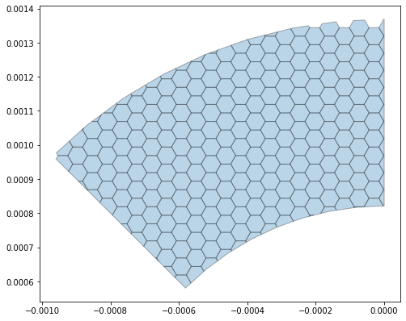

**gridShape**
==============
gridShape module functionality involved to create grid geometry for a given boundary geometry.

squareGrid
------------

*Create square grid polygon geometry for given boundary geometry*

:module: geoshapes.gridShape.squareGrid

.. function:: squareGrid(boundary, length:int, cut:bool = False)

   :param boundary: Boundary shapefile or geopandas GeoDataFrame type
   :type boundary: str / geopandas.GeoDataFrame
   :param length: length of the side of a square grid in meters
   :type length: int
   :param cut: intersects grid polygon with boundary area
   :type cut: True
   :return: Square grid of the boundary
   :rtype: geopandas.GeoDataFame
    
.. container:: header

    **Code Block**

.. code-block:: python

  import geoshapes, gropandas
  
  fileData = geopandas.read_file("./polygonShapefileData.shp")
  bounds = fileData.geometry[0]
  dr = geopandas.GeoDataFrame(crs = 'EPSG:3857', geometry = [bounds])
  dr = dr.to_crs('EPSG:4326')
  square = geoshapes.gridShape.squareGrid(dr, 10, cut = True)
  square.plot(
        figsize=(8, 7),
        alpha=0.3,
        edgecolor='k'
        )
  
.. container:: header

        *Output Map*
.. image:: ../docs/images/squareGrid.png
   :scale: 80 %
   :alt: squareGrid Output
   :align: center

----------------------------------------------------------------------------------------------------

hexagonGrid
------------

*Create hexagon grid polygon geometry for given boundary geometry*

:module: geoshapes.gridShape.hexagonGrid

.. function:: hexagonGrid(gdf, length:int, cut:bool = False)

   :param gdf: geopandas GeoDataFrame type
   :type gdf: geopandas.GeoDataFrame
   :param spacing: length of the side of a hexagon grid in meters
   :type spacing: int
   :param cut: intersects hexagon grid polygon with boundary area
   :type cut: True
   :return: Square grid of the boundary
   :rtype: geopandas.GeoDataFame
    
.. container:: header

    **Code Block**

.. code-block:: python

  import geoshapes, gropandas
  
  fileData = geopandas.read_file("./polygonShapefileData.shp")
  bounds = fileData.geometry[0]
  dr = geopandas.GeoDataFrame(crs = 'EPSG:3857', geometry = [bounds])
  dr = dr.to_crs('EPSG:4326')
  hexagon = geoshapes.gridShape.hexagonGridGrid(dr, 5, cut = True)
  hexagon.plot(
        figsize=(8, 7),
        alpha=0.3,
        edgecolor='k'
        )
  
.. container:: header

        *Output Map*

----------------------------------------------------------------------------------------------------

sanitizeGrid
------------

*Sanitize a polygon geometry for shrink/seperate the geometry*

:module: geoshapes.gridShape.sanitizeGrid

.. function:: sanitizeGrid(gdf, tolerance:int = 11)

   :param gdf: geopandas GeoDataFrame type
   :type gdf: geopandas.GeoDataFrame
   :param tolerance: Tolerance value can not be less than 11 (1.1 centimeter)
   :type tolerance: int
   :return: Sanitized grid of the boundary
   :rtype: geopandas.GeoDataFame
    
.. container:: header

    **Code Block**

.. code-block:: python

  import geoshapes, gropandas
  
  fileData = geopandas.read_file("./polygonShapefileData.shp")
  bounds = fileData.geometry[0]
  dr = geopandas.GeoDataFrame(crs = 'EPSG:3857', geometry = [bounds])
  dr = dr.to_crs('EPSG:4326')
  hexagon = geoshapes.gridShape.hexagonGridGrid(dr, 5, cut = True)
  sanitizedGrid = geoshapes.gridShape.sanitizeGrid(fr, 3500) #35 meter seperability
  sanitizedGrid.plot(
        figsize=(8, 7),
        alpha=0.3,
        edgecolor='k'
        )
  
.. container:: header

        *Output Map*
.. image:: ../docs/images/sanitizedoGrid.png
   :scale: 100%
   :alt: hexagonGrid Output
   :align: center

----------------------------------------------------------------------------------------------------