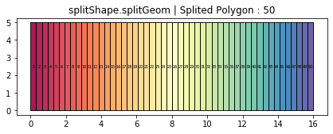
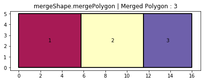
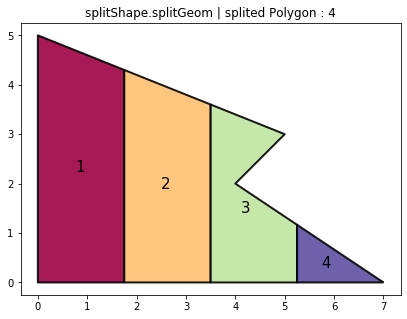
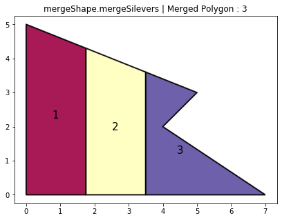
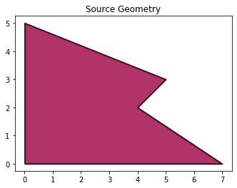
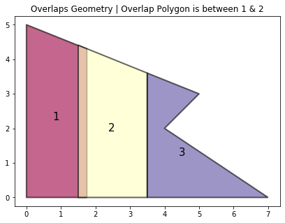
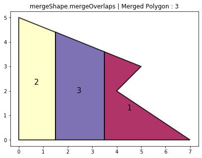

.. image:: https://www.repostatus.org/badges/latest/active.svg
   :alt: Project Status: Active – The project has reached a stable, usable state and is being actively developed.
   :target: https://www.repostatus.org/#active

.. image:: https://badge.fury.io/py/geoshapes.svg
   :target: https://badge.fury.io/py/geoshapes

**mergeShape**
==============
mergeShape module functionality involved to merge splited geometry for a defined number of geometry.

mergePolygon
------------

*Merge splited polygon geometry for a defined number of geometry*

:module: geoshapes.mergeShape.mergePolygon

.. function:: mergePolygon(geomData, mergedPoly:int)

   :param geomData: list of shapely polygon geometry or geopandas GeoDataFrame
   :type geomData: list/geopandas.GeoDataFrame
   :param mergedPoly: least Number of Merged geometry.
   :type mergedPoly: int
   :return: A geopandas GeoDataFrame
   :rtype: geopandas.GeoDataFame
    
.. container:: header

    **Code Block**

.. code-block:: python

    import string, shapely, geoshapes, geopandas
    polys = shapely.geometry.Polygon([(0, 0), (0,5), (16, 5), (16, 0)])
    splitGeometry = geoshapes.splitShape.splitGeom(polys, 50, rotation = 120)
    
    #Input Polygon geometry for mergePolygon function
    splitGeometry['ids'] = range(len(splitGeometry))
    ax1 = splitGeometry.plot(figsize = (7,5), alpha = 0.9, cmap = 'Spectral', edgecolor = 'k', linewidth = 1)
    ax1.set_title('splitShape.splitGeom | Splited Polygon : 50')
    splitGeometry.apply(
        lambda x: ax1.annotate(
            s=f"{x.ids+1}",
            xy=x.geometry.centroid.coords[0],
            ha='center',
            va='center',
            size=5
            ),
        axis=1
        )
    
    #Output Polygon geometry for mergePolygon function
    geoData = geoshapes.mergeShape.mergePolygon(splitGeometry, 3)
    geoData['ids'] = range(len(geoData))
    ax = geoData.plot(figsize = (7,5), alpha = 0.9, cmap = 'Spectral', edgecolor = 'k', linewidth = 2)
    ax.set_title('mergeShape.mergePolygon | Merged Polygon : 3')
    geoData.apply(
        lambda x: ax.annotate(
            s=f"{x.ids+1}",
            xy=x.geometry.centroid.coords[0],
            ha='center',
            va='center',
            size=10
            ),
        axis=1
        )

.. container:: header

        *Input Polygon*
        

   
.. container:: header

        *Output Map*

----------------------------------------------------------------------------------------------------

mergeSilevers
-------------

*Merge silever geometry (smaller in size than average size geometry) with its neighbor geometry*

:module: geoshapes.mergeShape.mergeSilevers

.. function:: mergeSilevers(geomData, splitGeoms:int)

   :param geomData: list of shapely polygon geometry
   :type geomData: list
   :param splitGeoms: least Number of geometry that should be returned after dissolve silever.
   :type splitGeoms: int
   :return: A list of shapely polygon collection
   :rtype: list
    
.. container:: header

    **Code Block**

.. code-block:: python

    import shapely, geoshapes, geopandas
    polys = shapely.geometry.Polygon([(0, 0), (0,5), (5, 3), (4, 2), (7, 0)])
    
    #Input Polygon geometry for mergeSilever function
    splitGeometry = geoshapes.splitShape.splitGeom(polys,4, rotation = 120)
    splitGeometry['ids'] = range(len(splitGeometry))
    ax1 = splitGeometry.plot(figsize = (7,5), alpha = 0.9, cmap = 'Spectral', edgecolor = 'k', linewidth = 2)
    ax1.set_title('splitShape.splitGeom | splited Polygon : 4')
    splitGeometry.apply(
        lambda x: ax1.annotate(
            s=f"{x.ids+1}",
            xy=x.geometry.centroid.coords[0],
            ha='center',
            va='center',
            size=15
            ),
        axis=1
        )
    
    # Output Polygon geometry for mergeSilever function
    geoData = geopandas.GeoDataFrame(geometry = geoshapes.mergeShape.mergeSilevers([i for i in splitGeometry.geometry], 3))
    geoData['ids'] = range(len(geoData))
    ax = geoData.plot(figsize = (7,5), alpha = 0.9, cmap = 'Spectral', edgecolor = 'k', linewidth = 2)
    ax.set_title('mergeShape.mergeSilevers | Merged Polygon : 3')
    geoData.apply(
        lambda x: ax.annotate(
            s=f"{x.ids+1}",
            xy=x.geometry.centroid.coords[0],
            ha='center',
            va='center',
            size=15
            ),
        axis=1
        )

.. container:: header

        *Input Polygon*
        

   
.. container:: header

        *Output Map*

----------------------------------------------------------------------------------------------------

mergeoverlaps
-------------

*Merge overlapped polygon with its neighbor geometry*

:module: geoshapes.mergeShape.mergeoverlaps

.. function:: mergeoverlaps(sourceGeoms, processedGeoms:list)

   :param sourceGeoms: A single shapely polygon geometry
   :type sourceGeoms: shapely polygon geometry
   :param processedGeoms: list of shapely polygon geometry collection
   :type processedGeoms: list
   :return: A list of shapely polygon collection
   :rtype: list
    
.. container:: header

    **Code Block**

.. code-block:: python

    import shapely, geoshapes, geopandas
    polys = shapely.geometry.Polygon([(0, 0), (0,5), (5, 3), (4, 2), (7, 0)])
    
    overlapsPoly0 = shapely.geometry.Polygon(
        [(1.75, 0), (0, 0), (0, 5),
         (1.75, 4.3), (1.75, 0)]
        )
    
    overlapsPoly1 = shapely.geometry.Polygon(
        [(3.5, 0), (1.5, 0), (1.5, 4.406666666666667),
         (3.5, 3.6), (3.5, 0)]
        )
    
    overlapsPoly2 = shapely.geometry.Polygon(
        [(7, 0), (5.25, 0), (3.5, 0), (3.5, 3.6), (5, 3),
         (4, 2), (5.25, 1.166666666666667), (7, 0)]
        )
    
    #Input Polygon as source geometry for mergeoverlaps function
    sourceGeom = geopandas.GeoDataFrame(geometry = [polys])
    source = sourceGeom.plot(cmap = 'Spectral', alpha = 0.8, edgecolor = 'k', linewidth = 2)
    source.set_title('Source Geometry')
    
    #Input overlaps Polygon geometry for mergeoverlaps function
    overlapGeom = geopandas.GeoDataFrame(geometry = [overlapsPoly0, overlapsPoly1, overlapsPoly2])
    overlapGeom['ids'] = range(len(overlapGeom))
    
    ax1 = overlapGeom.plot(figsize = (7,5), alpha = 0.6, cmap = 'Spectral', edgecolor = 'k', linewidth = 2)
    ax1.set_title('Overlaps Geometry | Overlap Polygon is between 1 & 2')
    overlapGeom.apply(
        lambda x: ax1.annotate(
            s=f"{x.ids+1}",
            xy=x.geometry.centroid.coords[0],
            ha='center',
            va='center',
            size=15
            ),
        axis=1
        )
    
    # Output Polygon geometry for mergeOverlaps function
    geoData = geopandas.GeoDataFrame(
        geometry = geoshapes.mergeShape.mergeOverlaps(
            polys,
            [overlapsPoly0,
             overlapsPoly1,
             overlapsPoly2]
            )
        )
    
    geoData['ids'] = range(len(geoData))
    ax = geoData.plot(
        figsize = (7,5),
        alpha = 0.8,
        cmap = 'Spectral',
        edgecolor = 'k',
        linewidth = 2)
    
    ax.set_title('mergeShape.mergeOverlaps | Merged Polygon : 3')
    
    geoData.apply(
        lambda x: ax.annotate(
            s=f"{x.ids+1}",
            xy=x.geometry.centroid.coords[0],
            ha='center',
            va='center',
            size=15
            ),
        axis=1
        )

.. container:: header

        *Input Source Polygon*
        

.. container:: header

        *Input Overlaps Polygon*
        

.. container:: header

        *Output & Map*
        
**--| Source Geometry Area is : 205000000001.0 square meter**

**--| Processed Geometry Area is : 215941666666.67 square meter**

----------------------------------------------------------------------------------------------------