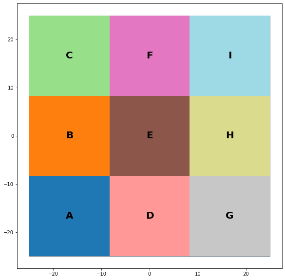
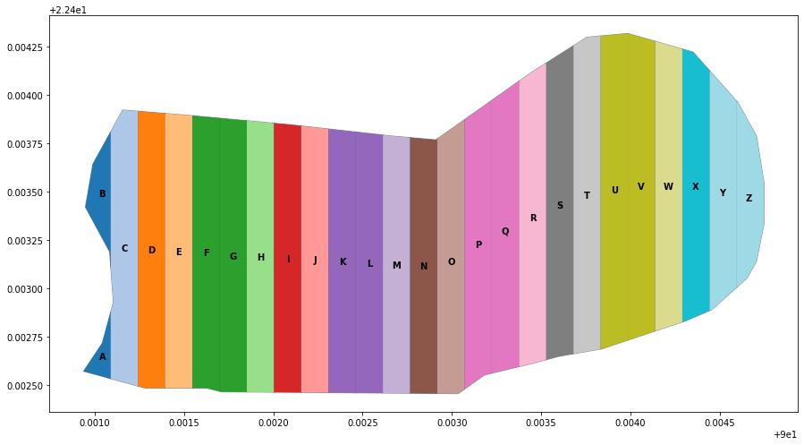

Modules
*******

**splitShape**
==============
splitShape module functionality involved in geometry splitting as creating geometry for experimetal design plot / trial design.

splitLatin
-----------

*Create a Latin Square experimental design with equal size as a polygon*

:module: geoshapes.splitShape.splitLatin

<<<<<<< Updated upstream
.. function:: splitLatin(geoms:shapely.geometry.Point, bufferLength:int)

   :param geoms: single shapely point geometry
   :type geoms: shapely.geometry.Point
   :param bufferLength: Insert the sideLength of the square geometry regarding the CRS
   :type bufferLength: int
   :return: collectin/list of shapely polygon geometry
   :rtype: list
=======
    :module: geoshapes.splitShape.splitLatin
    
    .. function:: splitLatin (geoms:shapely.geometry.Point, bufferLength:int)
       
       
       :param geoms: single shapely point geometry
       :type geoms: shapely.geometry.Point
       :param bufferLength: Insert the sideLength of the square geometry regarding the CRS
       :type bufferLength: int
       :return: Collectin of shapely polygon geometry
       :rtype: list
>>>>>>> Stashed changes
    
.. tip::
    
    * *Latin Square will create 9 polygon geometry but you can select which one you want by selecting individual polygon*
.. container:: header

    **Code Block**

.. code-block:: python

  import string, shapely, geoshapes, geopandas
  
  point = shapely.geometry.Point(0,0)
  c = geoshapes.splitShape.splitLatin(point, 25)
  ft = geopandas.GeoDataFrame(geometry = c, crs = 'EPSG:4326')
  ft['ids'] = range(len(ft))
  ft['Group']= ft.apply(lambda row : string.ascii_uppercase[int(row.ids)], axis = 1)
  ax = ft.plot(figsize=(15, 10), alpha=0.4, edgecolor='k')
  ft.plot(column='Group', ax=ax, linewidth=9, cmap='tab20');
  ft.apply(lambda x: ax.annotate(s=f"{x.Group}",
                                 xy=x.geometry.centroid.coords[0],
                                 weight='bold',
                                 ha='center',
                                 va='center',
                                 size=20),axis=1)

.. container:: header

        *Output Map*

----------------------------------------------------------------------------------------------------

splitGeom
---------

*Split a polygon geometry by required number of splits along to the major axis.*

.. note::

:module: geoshapes.splitShape.splitGeom

.. function:: splitGeom (geoms:shapely.geometry.Polygon, splits:int, **kwargs:dict)

   :param geoms: Single shapely Polygon geometry
   :type geoms: shapely.geometry.polygon
   :param splits: Number of splits required
   :type splits: int
   :param rotation: Rotation angle in degree, insert the degree that required, Default is 30
   :type rotation: int, optional
   :return: List of shapely polygon or multi-polygon geometry
   :rtype: list

.. caution::
    
    * *Try to assign the rotation degree less than 120 because, it will increase the processing time to calculate the best possible fit to findout the major axis for the polygon, if it increased.*
    * *Number of splits is always more than the splits number assigned, if found multi-polygon while it splits geometry. As 25 assigned into the code example for the splits parameter but it returned 26 piece of geometry.*

.. container:: header

    **Code Block**

.. code-block:: python

    import string, shapely, geoshapes, geopandas
    sdf = geopandas.read_file("./filePoly.shp")
    fl = shapely.geometry.box(*sdf.geometry[3].bounds).intersection(sdf.geometry[3])
    c = geoshapes.splitShape.splitGeom(geoms = fl, splits = 25, rotation = 30)

    gdf = geopandas.GeoDataFrame(geometry = c, crs = 'EPSG:3857')
    gdf['ids'] = range(len(gdf))
    gdf['Group']= gdf.apply(lambda row : string.ascii_uppercase[int(row.ids)], axis = 1)
    ax = gdf.plot(figsize=(15, 10), alpha=0.0, edgecolor='k')
    gdf.plot(column='Group', ax=ax, linewidth=9, cmap='tab20');

    gdf.apply(lambda x: ax.annotate(s=f"{x.Group}",
                                    xy=x.geometry.centroid.coords[0],
                                    weight='bold', ha='center',
                                    va='center', size=10),axis=1)
    

.. container:: header

        *Output Map*

----------------------------------------------------------------------------------------------------

.. _splitCircle:: Split Circle

splitCircle
-----------

*To get splited polgon for circular area. i.e. Experimental Design*

.. note::

    :module: geosolution.splitShape.splitCircle
        
    .. function:: splitCircle (geoms:shapely.geometry.Point, circleRadius:float, incrementDegree:int, **kwargs:dict)
       
       :param geoms: Single shapely Point geometry
       :type geoms: shapely.geometry.point
       :param circleRadius: Buffer length in feet 
       :type circleRadius: float
       :param incrementDegree: degree increament step-wise (1 - 160)
       :type incrementDegree: int
       :param clipInterior: Default is False. if True, returns intersected geomerty
       :type clipInterior: bool, optional
       :param innerWidth: Assign the number in feet that it should be intersected from the Centroid for whole geometry, default is 1.
       :type innerWidth: int, optional
       :param getGeom: Default is 'Both', Three specific option as 'Inner', 'Outer' and 'Both', returns the specific one as assigned
       :type getGeom: int, optional
       :return: Returns a collection of shapely polygon geometry
       :rtype: list

.. caution::
    
    * *Try to assign the incrementDegree less than 160 because, it won't intersect the circular area symetrically , if it increased.*

.. container:: 

    .. container:: header

        **Code Block**

    .. code-block:: python
        :linenos:
    
         import string, shapely, geosolution, geopandas
         pointLocation = shapely.geometry.Point(0,0)
         polygonList = geosolution.splitShape.splitCircle(geoms = pointLocation,
                                                          circleRadius = 500,
                                                          incrementdegree = 45,
                                                          clipInterior = True,
                                                          innerWidth = 100,
                                                          getGeom = 'Both'
                                                          )
         gdf = geopandas.GeoDataFrame(geometry = polygonList, crs = 'EPSG:3857')
         gdf['ids'] = range(len(gdf))
         gdf['Group']= gdf.apply(lambda row : string.ascii_uppercase[int(row.ids)], axis = 1)
         ax = gdf.plot(figsize=(15, 10), alpha=0.0, edgecolor='k')
         gdf.plot(column='Group', ax=ax, linewidth=9, cmap='tab20');
         gdf.apply(lambda x: ax.annotate(s=f"Group : {x.Group}{x.ids}",
                                         xy=x.geometry.centroid.coords[0],
                                         weight='bold', ha='center',
                                         va='center', size=10),axis=1
                                         )

    .. container:: header

        *Output Map*
        
    .. image:: splitCircle.png
       :width: 600px
       :height: 600px
       :scale: 70 %
       :alt: Split Circle Output
       :align: center

----------------------------------------------------------------------------------------------------

.. _splitCircleSquare:: Split Circle Square

splitCircleSquare
-----------------

*To get splited polgon and partial circle for circular area. i.e. Experimental Design*

.. Note::

    :module: geosolution.splitShape.splitSquare
    
    .. function:: splitCircleSquare (geoms:shapely.geometry.Point, circleRadius:float, rotation:int)
       
       
       :param geoms: single shapely Point geometry
       :type geoms: shapely.geometry.Point
       :param circleRadius: Insert the sideLength of the square geometry in feet
       :type circleRadius: float
       :param rotation: Rotation angle in degree, insert the degree that required, Default is 45.
       :type rotation: int, optional
       :return: List of shapely polygon or multipolygon geometry
       :rtype: list

.. container:: 

    .. container:: header

        **Code Block**

    .. code-block:: python
       :linenos:
    
        import string, shapely, geosolution, geopandas
        pointLocation = shapely.geometry.Point(0,0)
        polygonList = geosolution.splitShape.splitCircleSquare(geoms = pointLocation,
                                                               circleRadius = 500,
                                                               rotation = 45,
                                                              )
        gdf = geopandas.GeoDataFrame(geometry = polygonList, crs = 'EPSG:3857')
        gdf['ids'] = range(len(gdf))
        gdf['Group']= gdf.apply(lambda row : string.ascii_uppercase[int(row.ids)], axis = 1)
        ax = gdf.plot(figsize=(15, 10), alpha=0.0, edgecolor='k')
        gdf.plot(column='Group', ax=ax, linewidth=9, cmap='tab20');
        gdf.apply(lambda x: ax.annotate(s=f"Group : {x.Group}{x.ids}",
                                        xy=x.geometry.centroid.coords[0],
                                        weight='bold', ha='center',
                                        va='center', size=10),axis=1)

    .. container:: header

        *Output Map*
        
    .. image:: splitCircleSquare.png
       :width: 600px
       :height: 600px
       :scale: 70 %
       :alt: Split Circle Output
       :align: center

----------------------------------------------------------------------------------------------------

.. _splitSquare::

splitSquare
-----------

*Split a square polygon with 4 or 5 different equal parts as a polygon*

.. Note::

    :module: geosolution.splitShape.splitSquare
    
    .. function:: splitSquare (geoms:shapely.geometry.Point, sideLength:float, rotation:int, includeInterior:boolean)
       
       
       :param geoms: single shapely point geometry
       :type geoms: shapely.geometry.Point
       :param sideLength: Insert the sideLength of the square geometry in feet
       :param sideLength: float
       :param rotation: Rotation angle in degree, insert the degree that required, Default is 45.
       :type rotation: int
       :param includeInterior: The default is True. if ‘False’, returns polygon without the interior polygon shape.
       :param includeInterior: bool, optional
       :return: List of shapely polygon or multipolygon geometry
       :rtype: list
    
.. caution::
    
    * *If includeInterior is False, then square geometry from the center will be removed.*

.. container:: 

    .. container:: header

        **Code Block**

    .. code-block:: python
        :linenos:
    
         import string, shapely, geosolution, geopandas
         pointLocation = shapely.geometry.Point(0,0)
         polygonList = geosolution.splitShape.splitSquare(geoms = pointLocation,
                                                          sideLength = 50,
                                                          rotation = 45,
                                                          includeInterior = True
                                                          )
         gdf = geopandas.GeoDataFrame(geometry = polygonList, crs = 'EPSG:3857')
         gdf['ids'] = range(len(gdf))
         gdf['Group']= gdf.apply(lambda row : string.ascii_uppercase[int(row.ids)], axis = 1)
         ax = gdf.plot(figsize=(15, 10), alpha=0.0, edgecolor='k')
         gdf.plot(column='Group', ax=ax, linewidth=9, cmap='tab20');
         gdf.apply(lambda x: ax.annotate(s=f"Group : {x.Group}{x.ids}",
                                         xy=x.geometry.centroid.coords[0],
                                         weight='bold', ha='center',
                                         va='center', size=10),axis=1)

    .. container:: header

        *Output Map*
        
    .. image:: splitSquare.png
       :width: 600px
       :height: 600px
       :scale: 70 %
       :alt: Split Circle Output
       :align: center

----------------------------------------------------------------------------------------------------
